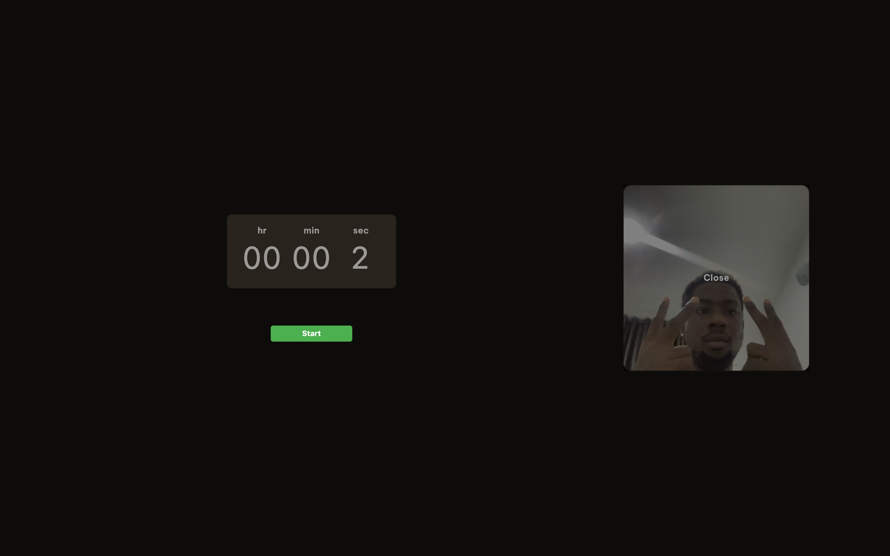

# Flutter desktop application

### This is a timer desktop application(macos only) that takes a headshot of the user and a screenshot of the at the end of the timer
#### Not tested on windows yet

## Package used 
 - Freezed 
 - Bloc state management
 - camera_macos
 - camera_windows 
 - screenshot 

## Clone the repo
 - https://github.com/uuthman/best_assessment.git
 - cd assessment_test
 - flutter pub get

## Generate the freezed classes
 - dart flutter pub run build_runner build --delete-conflicting-outputs

